  

  

  

## 📌 About Me
- 🎓 𝐁.𝐓𝐞𝐜𝐡 𝐂𝐒𝐄 𝐬𝐭𝐮𝐝𝐞𝐧𝐭 𝐚𝐭 𝐒𝐑𝐌 𝐔𝐧𝐢𝐯𝐞𝐫𝐬𝐢𝐭𝐲 𝐀𝐏
- 💻 𝐏𝐚𝐬𝐬𝐢𝐨𝐧𝐚𝐭𝐞 𝐚𝐛𝐨𝐮𝐭 𝐂++, 𝐩𝐫𝐨𝐠𝐫𝐚𝐦𝐦𝐢𝐧𝐠, 𝐚𝐧𝐝 𝐩𝐫𝐨𝐛𝐥𝐞𝐦-𝐬𝐨𝐥𝐯𝐢𝐧𝐠
- 🚀 𝐈𝐧𝐭𝐞𝐫𝐞𝐬𝐭𝐞𝐝 𝐢𝐧 𝐀𝐈, 𝐌𝐚𝐜𝐡𝐢𝐧𝐞 𝐋𝐞𝐚𝐫𝐧𝐢𝐧𝐠 .
- 🌱 𝐂𝐮𝐫𝐫𝐞𝐧𝐭𝐥𝐲 𝐥𝐞𝐚𝐫𝐧𝐢𝐧𝐠 𝐃𝐚𝐭𝐚 𝐒𝐭𝐫𝐮𝐜𝐭𝐮𝐫𝐞𝐬 𝐚𝐧𝐝 𝐀𝐥𝐠𝐨𝐫𝐢𝐭𝐡𝐦𝐬
- 🛰️ 𝐄𝐱𝐩𝐥𝐨𝐫𝐢𝐧𝐠 𝐇𝐚𝐜𝐤𝐚𝐭𝐡𝐨𝐧 𝐜𝐡𝐚𝐥𝐥𝐞𝐧𝐠𝐞𝐬 𝐚𝐧𝐝 𝐢𝐧𝐧𝐨𝐯𝐚𝐭𝐢𝐯𝐞 𝐩𝐫𝐨𝐣𝐞𝐜𝐭𝐬
- 🤝 𝐎𝐩𝐞𝐧 𝐭𝐨 𝐜𝐨𝐥𝐥𝐚𝐛𝐨𝐫𝐚𝐭𝐢𝐧𝐠 𝐨𝐧 𝐭𝐞𝐜𝐡 𝐩𝐫𝐨𝐣𝐞𝐜𝐭𝐬
- 📚 𝐀𝐥𝐰𝐚𝐲𝐬 𝐞𝐚𝐠𝐞𝐫 𝐭𝐨 𝐥𝐞𝐚𝐫𝐧 𝐧𝐞𝐰 𝐭𝐞𝐜𝐡𝐧𝐨𝐥𝐨𝐠𝐢𝐞𝐬
- ⚡ 𝐆𝐨𝐚𝐥: 𝐁𝐮𝐢𝐥𝐝 𝐢𝐦𝐩𝐚𝐜𝐭𝐟𝐮𝐥 𝐬𝐨𝐟𝐭𝐰𝐚𝐫𝐞 𝐚𝐧𝐝 𝐛𝐞𝐜𝐨𝐦𝐞 𝐚 𝐬𝐮𝐜𝐜𝐞𝐬𝐬𝐟𝐮𝐥 𝐞𝐧𝐠𝐢𝐧𝐞𝐞𝐫

## 🧠 My Focus Areas
- 𝕎𝕖𝕓 𝕕𝕖𝕧𝕖𝕝𝕠𝕡𝕞𝕖𝕟𝕥
- 𝔸𝕡𝕡 𝕕𝕖𝕧𝕖𝕝𝕠𝕡𝕞𝕖𝕟𝕥
- 𝔸𝕀 / 𝕄𝕃
- 𝔻𝕒𝕥𝕒 𝕊𝕥𝕣𝕦𝕔𝕥𝕦𝕣𝕖𝕤

## 📊 GitHub Stats & Trophies

  

  

## 🛠️ Languages & Tools

<h3 align="center">Programming Languages</h3>

  &nbsp;&nbsp;&nbsp;&nbsp;&nbsp;&nbsp;&nbsp;&nbsp;&nbsp;
  &nbsp;&nbsp;&nbsp;&nbsp;&nbsp;&nbsp;&nbsp;&nbsp;&nbsp;
  

<h3 align="center">Frontend</h3>

  &nbsp;&nbsp;&nbsp;&nbsp;&nbsp;&nbsp;&nbsp;&nbsp;&nbsp;
  &nbsp;&nbsp;&nbsp;&nbsp;&nbsp;&nbsp;&nbsp;&nbsp;&nbsp;
  &nbsp;&nbsp;&nbsp;&nbsp;&nbsp;&nbsp;&nbsp;&nbsp;&nbsp;
  &nbsp;&nbsp;&nbsp;&nbsp;&nbsp;&nbsp;&nbsp;&nbsp;&nbsp;
  &nbsp;&nbsp;&nbsp;&nbsp;&nbsp;&nbsp;&nbsp;&nbsp;&nbsp;
  

<h3 align="center">Backend</h3>

  &nbsp;&nbsp;&nbsp;&nbsp;&nbsp;&nbsp;&nbsp;&nbsp;&nbsp;
  

<h3 align="center">Database</h3>

  &nbsp;&nbsp;&nbsp;&nbsp;&nbsp;&nbsp;&nbsp;&nbsp;&nbsp;
  &nbsp;&nbsp;&nbsp;&nbsp;&nbsp;&nbsp;&nbsp;&nbsp;&nbsp;
  

<h3 align="center">DevOps & Cloud</h3>

  &nbsp;&nbsp;&nbsp;&nbsp;&nbsp;&nbsp;&nbsp;&nbsp;&nbsp;
  &nbsp;&nbsp;&nbsp;&nbsp;&nbsp;&nbsp;&nbsp;&nbsp;&nbsp;
  &nbsp;&nbsp;&nbsp;&nbsp;&nbsp;&nbsp;&nbsp;&nbsp;&nbsp;
  &nbsp;&nbsp;&nbsp;&nbsp;&nbsp;&nbsp;&nbsp;&nbsp;&nbsp;
  &nbsp;&nbsp;&nbsp;&nbsp;&nbsp;&nbsp;&nbsp;&nbsp;&nbsp;
  

<h3 align="center">Tools</h3>

  &nbsp;&nbsp;&nbsp;&nbsp;&nbsp;&nbsp;&nbsp;&nbsp;&nbsp;
  &nbsp;&nbsp;&nbsp;&nbsp;&nbsp;&nbsp;&nbsp;&nbsp;&nbsp;
  

 

## 🔗 Connect with Me

  &nbsp;&nbsp;
  &nbsp;&nbsp;
  

  

  

